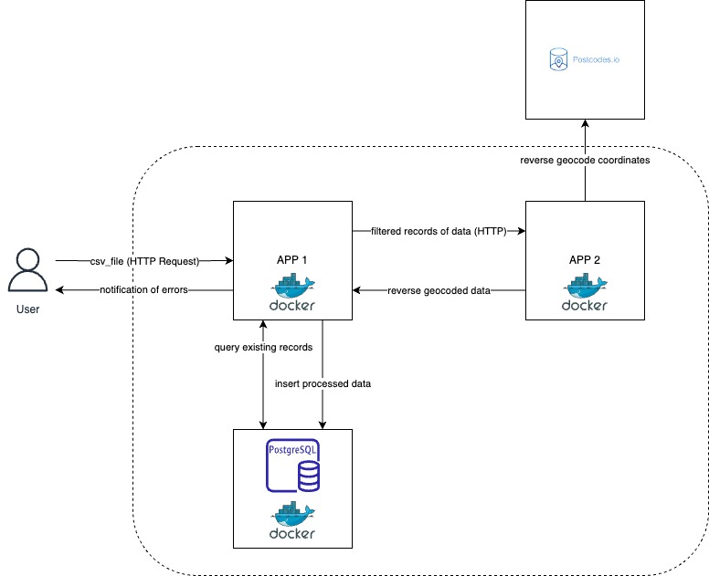

# biaenergy-test

## Deploy proyect:

```console
# Create a Docker custom network so containers can communicate between each other
$ docker network create bianetwork

# Deploy postgres container
1. cd ./postgres
2. docker build -t postgres-image .
3. docker run -d --name postgres-container -p 8080:5432 --network bianetwork postgres-image

# Deploy App 1
1. cd ./app1
2. docker build -t app1-image .
3. docker run -d --name app1-container -p 8000:8000 --network bianetwork app1-image

# Deploy app 2
1. cd ./app2
2. docker build -t app2-image .
3. docker run -d --name app2-container -p 80:80 --network bianetwork app2-image
```


## Architecture




## Example request in python:

```python
import requests

url = "http://0.0.0.0:8000/load_csv"

payload = {}
files=[
  ('csv_file',('postcodesgeo.csv',open('/path_to_file/postcodesgeo.csv','rb'),'text/csv'))
]
headers = {}

response = requests.request("POST", url, headers=headers, data=payload, files=files)
```

## Example request in cURL:

```cURL
curl --location 'http://0.0.0.0:8000/load_csv' \
--form 'csv_file=@"/path_to_file/postcodesgeo.csv"'
```

## Example response:
```json
{
    "msg": "reverse geocoding 1935757 points to get their respective postcodes.",
    "total_received": 2634087,
    "duplicated_records_removed": 613444,
    "existing_records_in_db_removed": 84886,
    "sent_to_api": 1935757
}
```